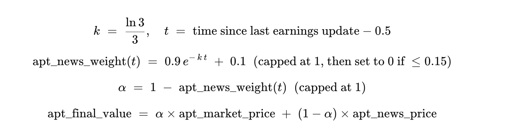
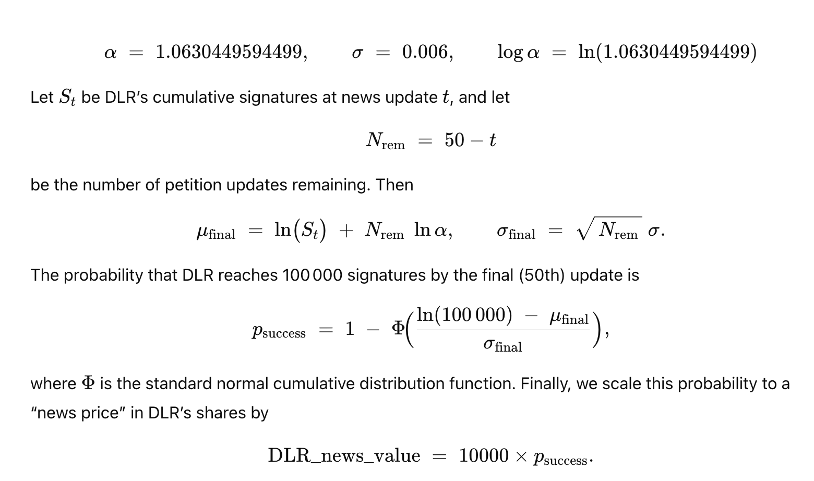

# UChicago Trading Competition

## Competition Overview  
Team Members: Ayush Pillai, Vivan Das, Elliot Gordon, Nick Park

The UChicago Trading Competition is a national algorithmic trading competition designed by senior members of the UChicago Financial Markets Program. The competition featured 2 challenges: Case 1 (market‑making) and Case 2 (portfolio allocation). On competition day, we focused entirely on Case 1 (market‑making), competing against both other teams and the case writer's bots on the exchange. Case 2 (portfolio allocation) was submitted in advance. Our team was one of 41 selected to compete, and we finished fifth overall and first among all UChicago teams. Below is our Case 1 write‑up, sharing what worked, what didn’t, and ideas for how we could improve.

## Case 1 Overview  
In Case 1, teams trade three stocks – APT (large‑cap), DLR (mid‑cap), MKJ (small‑cap) – and two ETFs: AKAV (basket of APT + DLR + MKJ) and AKIM (daily inverse of AKAV). AKAV can be created/redeemed via a swap (for a \$5 fee), whereas AKIM rebalances internally at end‑of‑day and cannot be created or redeemed.

- **Central Limit Order Books** for each tradable asset (stocks and ETFs).  
- **Risk Enforcement:**  
  - Position limits, open order limits, and maximum outstanding volume per symbol.  
  - Breaching any limit causes immediate order rejection without explanation.  

- **Round Structure:**  
  - Each round = 10 “trading days” × 90 seconds/day.  
  - Positions carry over day‑to‑day but reset at round end.  

- **News Schedule:**  
  - **APT:** Two structured earnings updates per day (at 30s and 60s).  
  - **DLR:** Five structured petition updates per day (every 15 seconds) reporting new signatures.  
  - **MKJ:** Multiple unstructured text news events; no guaranteed predictive power.   

- **ETFs & Swaps**  
   - **ETF (AKAV):** A single share represents 1 share of APT + 1 DLR + 1 MKJ. You can swap 1 ETF for 1 each stock (and vice versa) by paying a \$5 creation/redemption fee.  
   - **Inverse ETF (AKIM):** Daily moves opposite to AKAV. Does not allow creation/redemption; it simply resets every trading day. Because percentage up/down movements are asymmetric, holding AKIM introduces “volatility drag” over time.  

- **Asset Characteristics**  
   - **APT (Large‑Cap Stock):** Releases quarterly earnings. Fair value ≈ P/E ratio × EPS. Earnings news arrives at fixed intervals.  
   - **DLR (Mid‑Cap Binary Stock):** A petition’s success dictates final value. Use a log‑normal growth model on cumulative signatures to forecast probability of reaching 100000 by day 10. Settlement for DLR is binary: if petition signatures ≥ 100 000 by day 10, DLR settles at \$100; otherwise it settles at \$0 (bankruptcy). 
   - **MKJ (Small‑Cap Stock):** Receives only unstructured, often low‑quality news.

---

## Our Approach (Case 1)
1. **Fair Value Computation**  
   - **APT:**  
     - On each earnings update (at 30 s, 60 s), calculate `news_price = 10 (constant {P/E}) × EPS`.  
     - Blend with mid‑market midpoint via exponential time decay:
    
   - **DLR:**  
     - Maintain cumulative signatures and track “news event” index (up to 50 updates total).  
     - For each petition update, compute probability of reaching 100000 by day 10 using log‑normal forecast:  
    
   - **MKJ:**  
     - Since MKJ's unstructured news was often nonsense (mentions aliens, animals, etc.), we opted not to trade it. We did not attempt advanced NLP given time constraints.  
   - **AKAV:**  
     - Compute `synthetic_fair = fair_APT + fair_DLR + fair_MKJ`.  
     - Add a small position‑based tilt (e.g., +0.05 × DLR position) to account for inventory imbalance.  
     - Look for arbitrage opportunities: if `synthetic_fair > AKAV_market + \$5 + buffer`, execute a “toAKAV” swap; if `AKAV_market > synthetic_fair + \$5 + buffer`, execute a “fromAKAV” swap. 
   - **AKIM:**  
     - Because AKIM rebalances daily and cannot be created or redeemed, we opted not to trade it; it's market price was too unstable for fair modeling.

2. **Quote Placement & Spread Management**  
   - For each symbol, maintain a continuous quoting loop:  
     1. **Compute fair value** as above.  
     2. **Observe best competitor bid/ask** from local order book snapshot. If competitor bid exists, set our bid = competitor_bid + \$0.01; otherwise, default to a preset maximum edge (e.g., \$2). Mirror logic on the ask side.  
     3. **Enforce Minimum Spread** of \$0.01 and a maximum edge to avoid absurd prices.  
   - **Adjust for Inventory (Fading)**  
     - Optionally: `faded_fair = fair_value - 0.02 × position` to steer fill probabilities away from harmful inventory builds.

3. **Risk & Order Cancellation Logic**  
   - **Outstanding Volume:** If total unfilled volume + 60 shares > 120 (limit), cancel least competitive orders until volume is below threshold.  
   - **Stale Orders:** If our resting bid > new fair bid or resting ask < new fair ask, cancel those orders to avoid crossing stale quotes.  

---

## Future Improvements
1. **Dynamic Parameter Adjustment Over Rounds**
    On competition day, we were constrained by last‑minute fixes and ran with static parameters. In retrospect, a simple GUI‑driven configuration file could have allowed us to tweak spreads, order sizes, fading coefficients, etc. 
    As the rounds progressed, APT began to receive unstructured news that shifted fair values in between scheduled earnings updates. Similarly, MKJ news events grew more meaningful in the later rounds (e.g., “Disappointing subscriber growth” headlines). Instead of building a full NLP pipeline, which would slow down our order response times, a GUI parameters file could allow us to manually widen or tighten spreads for APT and MKJ on the fly.

2. **Detecting & Reacting to Large Orders**  
   Large market hits often signal high confidence from informed bot traders.  Our current approach simply cancels or widens spreads when a single order size exceeds our threshold. A more sophisticated improvement would be to treat any unusually large fill as a strong signal: immediately shift our fair‑value estimate closer to that trade price and re‑quote around this updated level. In practice, this means defining a “large‑order” threshold (e.g., 2× our typical lot size), then, upon detecting a fill above this threshold, applying a short‑lived price adjustment (for example, a weighted average between our previous fair value and the large fill price) before resuming normal quoting.